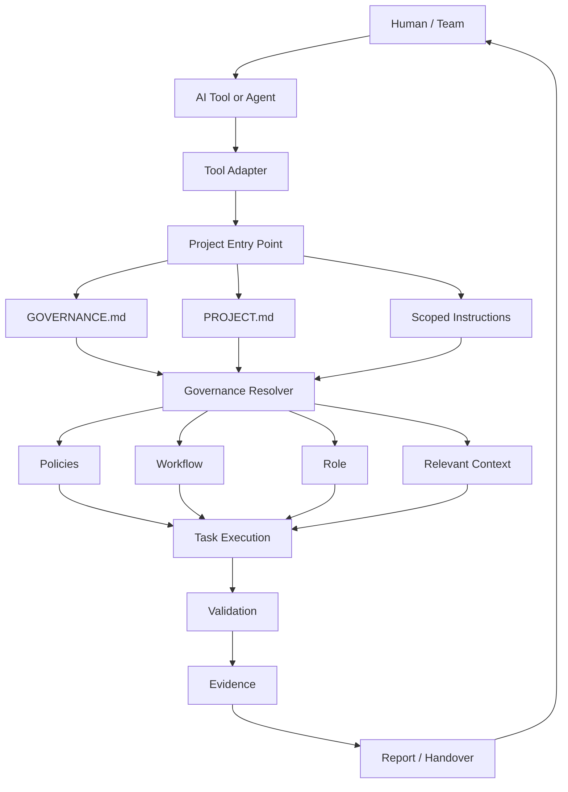
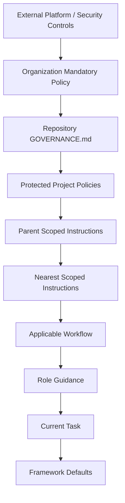
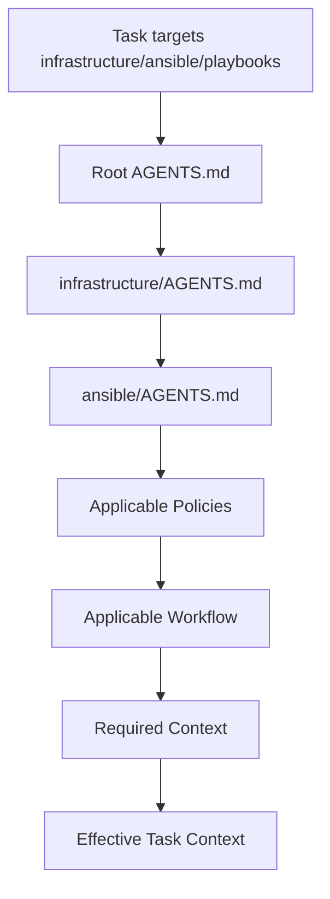
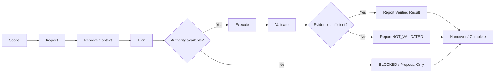
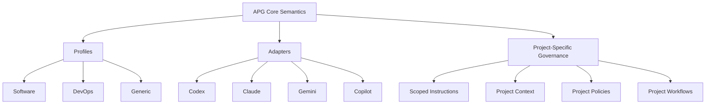
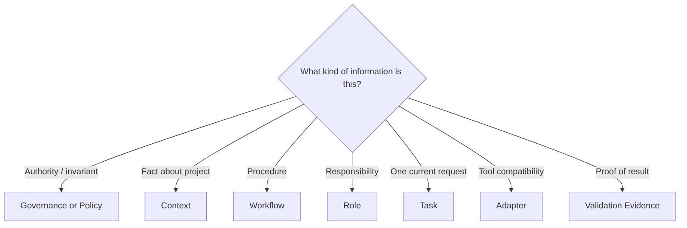

# Agentic Project Governance — فارسی / English

> **Bilingual Release v1.0.0**  
> **Initial Author & Maintainer:** Ahmad Sheikhi — Senior DevOps Engineer  
> **Persian:** concise conceptual guide and specification summary  
> **English:** full reference specification  
> **Canonical design status:** Initial public release  
> **HTML guide UI:** Persian RTL, local B Roya preference, English LTR, persistent Light/Dark theme switch

**Language navigation:** [فارسی](#حاکمیت-پروژه-برای-همکاری-انسان-و-عاملهای-هوش-مصنوعی) · [English](#english-edition)

---

# حاکمیت پروژه برای همکاری انسان و عامل‌های هوش مصنوعی
## راهنما و مشخصات مخزن — نسخه v1.0.0

> **وضعیت:** نسخه عمومی اولیه  
> **نام کاری مخزن:** `agentic-project-governance`  
> **نام کوتاه:** `APG`  
> **نسخه مشخصات:** `1.0`  
> **نویسنده و نگهدارنده اولیه:** احمد شیخی (Ahmad Sheikhi) — Senior DevOps Engineer  
> **هدف:** ایجاد یک ساختار روشن و مستقل از Vendor برای اینکه انسان‌ها و عامل‌های هوش مصنوعی بتوانند روی یک پروژه با قواعد، Context و روش اعتبارسنجی مشترک کار کنند.

[رفتن به نسخه English](#english-edition)

---

# 1. APG چیست؟

APG یک مدل هوش مصنوعی، Agent Runtime یا ابزار اجرای خودکار نیست.

APG یک **قرارداد داخل Repository** است. این قرارداد به انسان و AI توضیح می‌دهد:

- این پروژه چیست؛
- چه قواعدی دارد؛
- چه اطلاعاتی معتبر است؛
- چه کسی اختیار تصمیم یا اجرا دارد؛
- برای هر نوع کار چه Workflowای باید طی شود؛
- نتیجه با چه Evidenceای معتبر محسوب می‌شود؛
- و در پایان چه چیزی باید تحویل داده شود.

خلاصه ایده:

```text
Project
├── Governance
├── Project Definition
├── Scoped Instructions
├── Policies
├── Workflows
├── Context
├── Roles
├── Validation
└── Tool Adapters
```

**ابزار AI ممکن است عوض شود؛ قرارداد پروژه باید پایدار بماند.**

---

## 1.1 مدل ذهنی ساده

برای فهم APG این تشبیه کافی است:

| جزء | نقش |
|---|---|
| `GOVERNANCE.md` | قانون اساسی پروژه |
| `PROJECT.md` | شناسنامه پروژه و محدوده آن |
| `AGENTS.md` | نقطه ورود و Router |
| `Policies` | قواعد و محدودیت‌های لازم‌الاجرا |
| `Workflows` | روش استاندارد انجام کار |
| `Context` | اطلاعات و دانش لازم برای فهم پروژه |
| `Roles` | حدود مسئولیت هر نقش |
| `Validation` | شواهدی که صحت نتیجه را ثابت می‌کند |
| `Adapters` | لایه سازگاری با Codex، Claude، Gemini، Copilot و ابزارهای بعدی |

نکته مهم این است که همه‌چیز داخل یک `AGENTS.md` بزرگ ریخته نشود.

---

## 1.2 APG چه مشکلی را حل می‌کند؟

در پروژه‌های AI-assisted معمولاً این مشکلات دیده می‌شود:

- اطلاعات مهم فقط در Chat History باقی می‌ماند؛
- Rule، Context و Workflow با هم قاطی می‌شوند؛
- هر Tool نسخه متفاوتی از دستورهای پروژه دارد؛
- Rule محلی ممکن است ناخواسته Rule مهم پروژه را دور بزند؛
- Agent می‌گوید کار «درست است» بدون اینکه Validation واقعی انجام شده باشد؛
- با تغییر Tool یا مدل، بخش بزرگی از دستورهای پروژه باید دوباره نوشته شود؛
- Context غیرمرتبط ورودی Agent را شلوغ می‌کند؛
- مشخص نیست تصمیم نهایی با انسان است یا AI.

APG برای همین موارد یک ساختار ثابت، قابل مرور و قابل نگهداری تعریف می‌کند.

---

## 1.3 چه کسانی می‌توانند از APG استفاده کنند؟

APG فقط برای برنامه‌نویس یا DevOps نیست.

هر پروژه‌ای که **قواعد، اطلاعات، مراحل تکرارشونده، مسئولیت، Approval و Validation** داشته باشد می‌تواند از این مدل استفاده کند.

نمونه‌ها:

- DevOps و Infrastructure Automation؛
- Software Engineering؛
- Platform Engineering و SRE؛
- Human Resources؛
- مهندسی صنایع؛
- Business Operations؛
- Data Engineering و Analytics؛
- Security؛
- Research و Documentation؛
- Product Management؛
- Compliance؛
- Finance Operations.

پروژه حتی لازم نیست کد داشته باشد.

---

# 2. مثال‌های کاربردی

## 2.1 DevOps و Infrastructure Automation

فرض کنید تیم شما Linux، Ansible، Docker، Kubernetes، CI/CD و Production را مدیریت می‌کند.

Agent ممکن است بتواند یک Playbook درست بنویسد، اما بدون Governance نمی‌داند:

- Inventory اصلی کدام است؛
- Production Change نیاز به Approval دارد یا نه؛
- Canary اجباری است یا نه؛
- Restart مجاز است یا نه؛
- Secret باید از کجا خوانده شود؛
- چه Validationی لازم است؛
- Rollback چگونه باید ثبت شود.

ساختار نمونه:

```text
infra-automation/
├── AGENTS.md
├── GOVERNANCE.md
├── PROJECT.md
├── .governance/
│   ├── policies/
│   │   ├── authority.md
│   │   ├── change-control.md
│   │   ├── security.md
│   │   └── validation.md
│   ├── workflows/
│   │   ├── implementation.md
│   │   ├── canary-change.md
│   │   └── handover.md
│   └── context/
│       ├── architecture.md
│       ├── environments.md
│       └── conventions.md
├── ansible/
│   └── AGENTS.md
├── kubernetes/
│   └── AGENTS.md
└── ci/
    └── AGENTS.md
```

Workflow نمونه:

```text
Scope
→ Precheck
→ Canary
→ Approval
→ Apply
→ Validate
→ Report
```

در این مدل، AI فقط Automation تولید نمی‌کند؛ **روش درست کار در این پروژه را هم می‌فهمد.**

---

## 2.2 Software Engineering

در یک پروژه Software ممکن است Frontend، Backend، API، Test و Release هرکدام Rule متفاوت داشته باشند.

```text
product-platform/
├── AGENTS.md
├── GOVERNANCE.md
├── PROJECT.md
├── .governance/
│   ├── policies/
│   │   ├── security.md
│   │   ├── validation.md
│   │   └── documentation.md
│   ├── workflows/
│   │   ├── implementation.md
│   │   ├── review.md
│   │   └── release.md
│   └── context/
│       ├── architecture.md
│       ├── api-contracts.md
│       └── conventions.md
├── frontend/
│   └── AGENTS.md
├── backend/
│   └── AGENTS.md
└── tests/
    └── AGENTS.md
```

Root Governance می‌تواند بگوید:

- تغییر User-facing باید Test داشته باشد؛
- Secret نباید وارد Source Control شود؛
- Breaking API Change نیاز به Review دارد.

Backend و Frontend می‌توانند Rule محلی خودشان را اضافه کنند، بدون اینکه Governance اصلی را دوباره بنویسند.

---

## 2.3 Human Resources

در HR، مسئله اصلی Deployment نیست؛ **Privacy، Fairness، معیارهای استخدام و مالک تصمیم نهایی** مهم‌اند.

```text
recruitment-operations/
├── AGENTS.md
├── GOVERNANCE.md
├── PROJECT.md
├── .governance/
│   ├── policies/
│   │   ├── privacy.md
│   │   ├── fairness.md
│   │   ├── authority.md
│   │   └── documentation.md
│   ├── workflows/
│   │   ├── job-description.md
│   │   ├── candidate-screening.md
│   │   ├── interview-review.md
│   │   └── onboarding.md
│   └── roles/
│       ├── recruiter.md
│       ├── hiring-manager.md
│       └── reviewer.md
```

Governance می‌تواند روشن کند:

- AI می‌تواند Candidate Material را خلاصه کند؛
- AI تصمیم نهایی استخدام را نمی‌گیرد؛
- اطلاعات حساس Candidate نباید وارد ابزار عمومی شود؛
- Screening Criteria باید مستند و مرتبط با شغل باشد؛
- Human Reviewer مالک تصمیم نهایی است.

---

## 2.4 مهندسی صنایع و بهبود فرایند

APG برای Process Improvement هم کاربرد دارد.

```text
process-improvement/
├── AGENTS.md
├── GOVERNANCE.md
├── PROJECT.md
├── .governance/
│   ├── policies/
│   │   ├── data-quality.md
│   │   ├── safety.md
│   │   ├── validation.md
│   │   └── change-control.md
│   ├── workflows/
│   │   ├── process-study.md
│   │   ├── root-cause-analysis.md
│   │   ├── improvement-proposal.md
│   │   └── standard-work-update.md
│   └── context/
│       ├── process-map.md
│       ├── equipment.md
│       ├── constraints.md
│       └── kpi-definitions.md
```

Workflow نمونه:

```text
Define Scope
→ Verify Source Data
→ Map Current Process
→ Identify Bottleneck
→ Analyze Root Cause
→ Propose Improvement
→ Review Safety Impact
→ Pilot
→ Measure Result
→ Update Standard Work
→ Handover
```

APG در اینجا مشخص می‌کند:

- کدام داده معتبر است؛
- چه Safety Ruleای قابل دور زدن نیست؛
- چه کسی Process Change را Approve می‌کند؛
- Pilot چه زمانی لازم است؛
- Improvement با چه KPIای اثبات می‌شود.

---

## 2.5 Business Operations

برای کارهایی مثل Purchasing، Vendor Onboarding، Approval، Escalation و Service Request هم می‌توان از همین ساختار استفاده کرد.

```text
business-operations/
├── AGENTS.md
├── GOVERNANCE.md
├── PROJECT.md
└── .governance/
    ├── policies/
    │   ├── authority.md
    │   ├── financial-controls.md
    │   └── documentation.md
    ├── workflows/
    │   ├── vendor-onboarding.md
    │   ├── purchasing.md
    │   └── escalation.md
    └── roles/
        ├── requester.md
        ├── approver.md
        └── operator.md
```

مثلاً:

- AI می‌تواند Purchase Request را Draft کند؛
- AI می‌تواند Vendorها را مقایسه کند؛
- AI می‌تواند Approval Package آماده کند؛
- AI نباید درخواست خودش را Approve کند؛
- تعهد مالی نیاز به Authority واقعی دارد.

---

## 2.6 Data و Analytics

```text
analytics-platform/
├── AGENTS.md
├── GOVERNANCE.md
├── PROJECT.md
├── .governance/
│   ├── policies/
│   │   ├── data-access.md
│   │   ├── privacy.md
│   │   ├── validation.md
│   │   └── metric-governance.md
│   ├── workflows/
│   │   ├── pipeline-change.md
│   │   ├── dashboard-review.md
│   │   └── metric-definition.md
│   └── context/
│       ├── data-model.md
│       ├── source-systems.md
│       └── metric-catalog.md
├── pipelines/
│   └── AGENTS.md
└── dashboards/
    └── AGENTS.md
```

در این حوزه:

| موضوع | محل مناسب |
|---|---|
| تعریف KPI | Context / Metric Definition |
| اختیار تغییر KPI | Authority / Policy |
| روش تغییر Pipeline | Workflow |
| اثبات صحت داده | Validation |

---

## 2.7 Research و Documentation

حتی Repository بدون کد هم می‌تواند از APG استفاده کند.

```text
research-project/
├── AGENTS.md
├── GOVERNANCE.md
├── PROJECT.md
├── .governance/
│   ├── policies/
│   │   ├── source-quality.md
│   │   ├── citation.md
│   │   └── review.md
│   ├── workflows/
│   │   ├── research.md
│   │   ├── fact-check.md
│   │   └── publication.md
│   └── context/
│       ├── terminology.md
│       ├── research-scope.md
│       └── known-sources.md
└── reports/
```

Ruleهای نمونه:

- Claim باید Source قابل رهگیری داشته باشد؛
- Primary Source ترجیح داده شود؛
- Statement تأییدنشده باید مشخص شود؛
- Publication نیاز به Human Review دارد؛
- Citation ساختگی ممنوع است.

---

# 3. کاربر جدید از کجا شروع کند؟

برای شروع، کل Reference Repository را Copy نکنید.

یک پروژه کوچک فقط به چند فایل اصلی نیاز دارد.

## 3.1 `PROJECT.md`

در این فایل بنویسید:

- پروژه چیست؛
- چه خروجی‌ای دارد؛
- مالک آن کیست؛
- Dependencyهای اصلی چیست؛
- چه چیزی خارج از Scope است.

## 3.2 `GOVERNANCE.md`

در این فایل مشخص کنید:

- AI بدون Approval چه کاری می‌تواند انجام دهد؛
- چه کاری نیاز به Human Approval دارد؛
- چه کاری ممنوع است؛
- چه Ruleهایی قابل Override نیستند؛
- نتیجه برای Accepted شدن به چه Evidenceای نیاز دارد.

## 3.3 `AGENTS.md`

این فایل Entry Point است.

وظیفه‌اش این است که Agent را به Governance، Project Definition و Scoped Instructions هدایت کند.

**همه دانش پروژه را داخل این فایل نریزید.**

## 3.4 حداقل Governance

```text
.governance/
├── manifest.yaml
├── policies/
│   └── validation.md
└── workflows/
    └── default.md
```

## 3.5 Scope محلی فقط در صورت نیاز

```text
project/
├── AGENTS.md
├── frontend/
│   └── AGENTS.md
├── backend/
│   └── AGENTS.md
└── infrastructure/
    └── AGENTS.md
```

هر Child فقط Ruleهای مخصوص همان Subtree را اضافه می‌کند.

---

# 4. اصول طراحی

## 4.1 Repository منبع حقیقت است

AI Tool باید Governance پروژه را مصرف کند، نه اینکه خودش منبع اصلی Ruleها باشد.

## 4.2 Governance با Prompt فرق دارد

Rule پایدار باید داخل Repository باشد، نه در Chat History یا Prompt موقت.

## 4.3 هر نوع اطلاعات جای خودش را دارد

```text
Policy != Context != Workflow != Role != Task
```

| نوع | سؤال |
|---|---|
| Governance | چه کسی اختیار دارد و چه Ruleی قابل نقض نیست؟ |
| Project Definition | این پروژه چیست؟ |
| Policy | چه محدودیتی اعمال می‌شود؟ |
| Workflow | کار چگونه انجام می‌شود؟ |
| Context | چه اطلاعاتی باید بدانیم؟ |
| Role | مسئولیت این نقش چیست؟ |
| Task | درخواست فعلی چیست؟ |
| Validation | چه Evidenceای نتیجه را معتبر می‌کند؟ |

## 4.4 Rule محلی می‌تواند دقیق‌تر باشد، نه ضعیف‌تر

Child Rule می‌تواند Parent را تخصصی‌تر یا محدودتر کند.

اما نباید بدون سازوکار صریح، Security، Compliance یا Approval را ضعیف کند.

## 4.5 فقط Context مرتبط باید Load شود

Agent نباید برای هر Task کل Repository Governance را بخواند.

## 4.6 Validation بدون Evidence معتبر نیست

Agent نباید فقط با جمله «کار درست است» نتیجه را معتبر اعلام کند.

---

# 5. Prior Art و منشأ ایده‌ها

APG ادعا نمی‌کند `AGENTS.md`، Hierarchical Instructions یا Agent Context را اختراع کرده است.

این پروژه روی ایده‌هایی بنا شده که در ابزارهای مختلف وجود دارند و آن‌ها را در یک ساختار Vendor-neutral کنار هم قرار می‌دهد.

### OpenAI Codex

- `AGENTS.md`
- Hierarchical instruction discovery

منابع:

- https://developers.openai.com/codex/agent-configuration/agents-md
- https://developers.openai.com/codex/config-advanced

### Anthropic Claude Code

- `CLAUDE.md`
- Nested project instructions
- Scoped rules

منبع:

- https://docs.anthropic.com/en/docs/claude-code/memory

### GitHub Copilot

- Repository-wide instructions
- Path-specific instructions

منابع:

- https://docs.github.com/copilot/customizing-copilot/adding-custom-instructions-for-github-copilot
- https://docs.github.com/en/copilot/how-tos/copilot-cli/customize-copilot/add-custom-instructions

### Gemini CLI

- `GEMINI.md`
- Hierarchical context
- Agent skills

منابع:

- https://geminicli.com/docs/cli/gemini-md/
- https://geminicli.com/docs/cli/skills/
- https://geminicli.com/docs/reference/memport/

### چیزی که APG اضافه می‌کند

ترکیب زیر طراحی APG است:

```text
Governance
+ Project Definition
+ Hierarchical Instructions
+ Policies
+ Workflows
+ Context
+ Roles
+ Evidence / Validation
+ Thin Vendor Adapters
= Project Governance Contract
```

---

# 6. ساختار Reference Repository

```text
agentic-project-governance/
├── README.md
├── AGENTS.md
├── GOVERNANCE.md
├── PROJECT.md
├── CHANGELOG.md
├── CONTRIBUTING.md
├── SECURITY.md
├── LICENSE
│
├── .governance/
│   ├── README.md
│   ├── manifest.yaml
│   ├── policies/
│   │   ├── authority.md
│   │   ├── change-control.md
│   │   ├── security.md
│   │   ├── validation.md
│   │   └── documentation.md
│   ├── workflows/
│   │   ├── default.md
│   │   ├── implementation.md
│   │   ├── review.md
│   │   └── handover.md
│   ├── context/
│   │   ├── architecture.md
│   │   ├── conventions.md
│   │   ├── glossary.md
│   │   └── current-state.md
│   ├── roles/
│   │   ├── contributor.md
│   │   ├── reviewer.md
│   │   └── operator.md
│   └── templates/
│       ├── task.md
│       ├── decision.md
│       ├── report.md
│       └── handover.md
│
├── adapters/
│   ├── README.md
│   ├── codex/
│   │   └── AGENTS.md.template
│   ├── claude/
│   │   └── CLAUDE.md.template
│   ├── gemini/
│   │   └── GEMINI.md.template
│   └── copilot/
│       └── copilot-instructions.md.template
│
├── profiles/
│   ├── README.md
│   ├── generic/
│   ├── software/
│   └── devops/
│
├── examples/
│   ├── README.md
│   ├── minimal/
│   ├── monorepo/
│   └── operations/
│
├── docs/
│   ├── architecture.md
│   ├── governance-model.md
│   ├── instruction-resolution.md
│   ├── authoring-guide.md
│   ├── adapter-model.md
│   ├── extension-model.md
│   └── prior-art.md
│
├── tools/
│   ├── init-project.sh
│   └── validate-project.sh
│
└── .github/
    ├── ISSUE_TEMPLATE/
    │   ├── bug.yml
    │   └── proposal.yml
    └── PULL_REQUEST_TEMPLATE.md
```

---

# 7. قرارداد فایل‌های اصلی

## 7.1 `README.md`

صفحه معرفی عمومی پروژه است.

باید کوتاه و قابل فهم باشد و شامل این موارد باشد:

- APG چیست؛
- چه مشکلی حل می‌کند؛
- Quick Start؛
- یک دیاگرام ساده؛
- Example؛
- لینک Documentation؛
- روش Contribution.

## 7.2 `AGENTS.md`

Entry Point و Router است.

وظایف:

- معرفی Governance؛
- هدایت Agent به Context و Workflow مرتبط؛
- توضیح Scope و Inheritance؛
- تعریف حداقل Validation؛
- مشخص کردن رفتار در Conflict یا Missing Authority.

## 7.3 `GOVERNANCE.md`

بالاترین سند Normative پروژه است.

شامل:

- Authority؛
- Protected Rules؛
- Approval Requirements؛
- Security Boundaries؛
- Change Rules؛
- Validation Requirements؛
- Stop/Block Conditions؛
- Exception Process.

## 7.4 `PROJECT.md`

تعریف پایدار پروژه است:

```text
Project Name
Purpose
Problem Domain
Primary Users
Project Type
Criticality
Technology / Platform
Repository Boundaries
External Dependencies
Environment Model
Data Sensitivity
Deployment / Delivery Model
Owners
Known Constraints
Explicit Non-Goals
```

---

# 8. `.governance/`

این Directory محل Canonical Governance است و به Vendor خاص وابسته نیست.

## 8.1 `manifest.yaml`

یک Index کوچک Machine-readable است:

```yaml
spec_version: "1.0"

project:
  definition: "PROJECT.md"

governance:
  root: "GOVERNANCE.md"
  entrypoint: "AGENTS.md"

resolution:
  instruction_file: "AGENTS.md"
  inheritance: "root-to-leaf"
  local_rules_may:
    - specialize
    - restrict
  local_rules_may_not:
    - silently_weaken_parent_policy
    - bypass_required_approval
    - bypass_security_controls

directories:
  policies: ".governance/policies"
  workflows: ".governance/workflows"
  context: ".governance/context"
  roles: ".governance/roles"
  templates: ".governance/templates"

validation:
  require_evidence: true
  allow_unvalidated_claims: false
```

Manifest جای Governance Markdown را نمی‌گیرد؛ فقط Structure را قابل بررسی می‌کند.

---

# 9. Policies

Policy می‌گوید **چه محدودیتی باید رعایت شود**.

نمونه:

- `authority.md`: حدود اختیار؛
- `change-control.md`: کلاس و قواعد Change؛
- `security.md`: Security Constraintها؛
- `validation.md`: Evidence قابل قبول؛
- `documentation.md`: مستندات لازم بعد از Change.

نمونه Change Class:

```text
READ_ONLY
LOW_RISK_CHANGE
REVERSIBLE_CHANGE
HIGH_IMPACT_CHANGE
DESTRUCTIVE_CHANGE
PRODUCTION_CHANGE
```

---

# 10. Workflows

Workflow می‌گوید **کار با چه ترتیب استانداردی انجام شود**.

Workflow Governance را Override نمی‌کند.

### Default

```text
Scope
→ Inspect
→ Resolve Context
→ Plan
→ Execute
→ Validate
→ Report
```

### Implementation

```text
Understand Requirement
→ Inspect Existing Project
→ Identify Applicable Rules
→ Design Minimum Change
→ Implement
→ Validate
→ Document
→ Report
```

### Review

```text
Determine Review Scope
→ Load Relevant Policy
→ Inspect Evidence
→ Identify Findings
→ Classify Severity
→ Verify Material Findings
→ Report
```

### Handover

حداقل باید مشخص کند:

- چه چیزی تغییر کرد؛
- چرا؛
- چه چیزی Validate شد؛
- چه چیزی Validate نشد؛
- Risk چیست؛
- Rollback چیست؛
- Owner بعدی کیست.

---

# 11. Context

Context شامل **اطلاعات لازم برای فهم پروژه** است، نه Rule.

نمونه:

- `architecture.md`
- `conventions.md`
- `glossary.md`
- `current-state.md`

اطلاعات متغیر مانند Current Release یا Active Migration باید تاریخ به‌روزرسانی داشته باشند.

---

# 12. Roles

Role حدود مسئولیت را مشخص می‌کند.

Role قرار نیست یک Persona نمایشی بسازد.

### Contributor

- Existing Work را بررسی کند؛
- Change محدود انجام دهد؛
- Policy را رعایت کند؛
- Validation انجام دهد؛
- Evidence گزارش کند.

### Reviewer

- Correctness، Safety و Maintainability را بررسی کند؛
- Finding تأییدشده را از Suspicion جدا کند؛
- بدون Scope صریح وارد Remediation نشود.

### Operator

- Operational Safety را در اولویت بگذارد؛
- Approval Boundary را رعایت کند؛
- Reversible Operation را ترجیح دهد؛
- Post-change Validation انجام دهد.

---

# 13. Templates

Templateها برای خروجی‌های تکراری استفاده می‌شوند.

### Task

```text
Title
Objective
Scope
Inputs
Constraints
Authority
Expected Output
Validation
Out of Scope
```

### Decision

```text
Decision
Status
Context
Options Considered
Chosen Option
Rationale
Consequences
Reversal Conditions
Evidence / References
```

### Report

```text
Scope
Actions
Evidence
Result
Validation
Risks
Unvalidated Items
Next Action
```

### Handover

```text
Current State
Completed Work
Validation Evidence
Operational Notes
Known Risks
Rollback / Recovery
Pending Work
Ownership
```

---

# 14. `AGENTS.md` سلسله‌مراتبی

نمونه:

```text
example-project/
├── AGENTS.md
├── GOVERNANCE.md
├── PROJECT.md
├── backend/
│   ├── AGENTS.md
│   └── src/
├── frontend/
│   ├── AGENTS.md
│   └── src/
└── infrastructure/
    ├── AGENTS.md
    ├── ansible/
    │   ├── AGENTS.md
    │   └── playbooks/
    └── terraform/
        ├── AGENTS.md
        └── modules/
```

برای Task داخل `infrastructure/ansible/playbooks/`:

```text
Repository Governance
        ↓
Root AGENTS.md
        ↓
infrastructure/AGENTS.md
        ↓
infrastructure/ansible/AGENTS.md
        ↓
Applicable Policy
        ↓
Applicable Workflow
        ↓
Required Context
        ↓
Current Task
```

هر Child فقط Ruleهای مخصوص Scope خودش را نگه می‌دارد.

---

# 15. Rule Precedence

APG بین **Load Order** و **Authority** تفاوت می‌گذارد.

ترتیب مفهومی:

```text
1. External Platform / Security Restrictions
2. Organization-level Mandatory Policy
3. Repository GOVERNANCE.md
4. Scoped Protected Policy
5. Parent Scoped Instructions
6. Nearest Scoped Instructions
7. Applicable Workflow
8. Role Guidance
9. Current Task Instructions
10. Framework Defaults
```

اصل مهم:

> Rule نزدیک‌تر لزوماً Rule قدرتمندتر نیست.

یک Local Rule نمی‌تواند Approval یا Security Constraint بالاتر را حذف کند.

---

# 16. حل تعارض Ruleها

در Conflict:

1. Scope هر Rule مشخص شود؛
2. Authority Level بررسی شود؛
3. معلوم شود Specialization مجاز است یا نه؛
4. Protected Constraint حفظ شود؛
5. اگر ابهام Risk را تغییر می‌دهد، Agent باید متوقف شود و Guess نکند.

---

# 17. Context Resolution

APG باید Context را مرحله‌ای Resolve کند:

```text
Task
  ↓
Determine Working Scope
  ↓
Load Root Project Contract
  ↓
Find Applicable Scoped Instructions
  ↓
Resolve Required Policies
  ↓
Select Workflow
  ↓
Load Required Role
  ↓
Load Only Relevant Context
  ↓
Inspect Project Evidence
  ↓
Perform Task
```

هدف این است که Agent فقط اطلاعات لازم برای Task فعلی را بگیرد.

---

# 18. Validation و Evidence

این مفاهیم یکسان نیستند:

```text
Action
Result
Validation
Evidence
Claim
```

مثال:

- Action: Configuration تغییر کرد؛
- Result: File Modified شد؛
- Validation: Parser با موفقیت اجرا شد؛
- Evidence: Exit Code و Output ثبت شد؛
- Claim: Syntax Validation = PASS.

Statusهای پیشنهادی:

| Status | معنی |
|---|---|
| `PASS` | Validation لازم انجام شده و موفق بوده است. |
| `FAIL` | Validation انجام شده و شکست خورده است. |
| `BLOCKED` | Dependency، Permission، Authority یا Input مانع ادامه است. |
| `NO_CHANGE` | تغییری لازم یا انجام نشده است. |
| `NOT_VALIDATED` | کار ممکن است انجام شده باشد، اما Evidence لازم وجود ندارد. |

---

# 19. Human Authority

APG باید مرز Analysis و Action را مشخص کند.

Classهای نمونه:

```text
OBSERVE
PROPOSE
MODIFY
EXECUTE
DEPLOY
PUBLISH
DELETE
APPROVE
```

نمونه:

```yaml
authority:
  observe:
    default: allowed
  propose:
    default: allowed
  modify:
    default: task-scoped
  deploy:
    default: approval-required
  delete:
    default: approval-required
  publish:
    default: approval-required
```

این فقط Governance است؛ Enforcement واقعی همچنان باید در IAM، CI/CD، OS و Tool Runtime انجام شود.

---

# 20. Vendor Adapters

Core باید مستقل از Tool باقی بماند.

```text
                ┌────────────────────────┐
                │   Project Governance   │
                │  Canonical Source      │
                └───────────┬────────────┘
                            │
             ┌──────────────┼──────────────┐
             │              │              │
             ▼              ▼              ▼
        Codex Adapter   Claude Adapter  Gemini Adapter
             │              │              │
             ▼              ▼              ▼
        AGENTS.md       CLAUDE.md       GEMINI.md

                            │
                            ▼
                     Copilot Adapter
                            │
                            ▼
                copilot-instructions.md
```

Adapter فقط باید Tool را به Canonical Governance وصل کند.

نباید Policy را Duplicate یا Governance موازی ایجاد کند.

---

# 21. Profiles

Profile مجموعه Defaultهای اختیاری برای یک Domain است.

v1.0:

```text
generic/
software/
devops/
```

آینده:

```text
data/
security/
research/
documentation/
product/
hr/
legal/
finance/
industrial-engineering/
```

Profile می‌تواند Policy، Workflow، Role و Template اضافه کند، اما Core Semantics را تغییر نمی‌دهد.

---

# 22. حداقل Adoption

یک پروژه واقعی نباید کل Reference Repository را Copy کند.

حداقل شروع:

```text
project/
├── AGENTS.md
├── GOVERNANCE.md
├── PROJECT.md
└── .governance/
    ├── manifest.yaml
    ├── policies/
    │   └── validation.md
    └── workflows/
        └── default.md
```

هر Component فقط زمانی اضافه شود که مسئله واقعی حل کند.

---

# 23. Reference Repository در برابر پروژه واقعی

Reference Repository شامل Specification، Example، Profile، Adapter و Tool است.

اما پروژه مصرف‌کننده فقط بخش‌های موردنیازش را استفاده می‌کند.

```text
my-api/
├── AGENTS.md
├── GOVERNANCE.md
├── PROJECT.md
├── .governance/
│   ├── manifest.yaml
│   ├── policies/
│   │   ├── security.md
│   │   └── validation.md
│   └── workflows/
│       └── implementation.md
├── src/
└── tests/
```

هدف APG کم کردن ابهام است، نه زیاد کردن Documentation.

---

# 24. Multi-Domain Project

یک Repository بزرگ می‌تواند چند Scope داشته باشد:

```text
company-project/
├── AGENTS.md
├── GOVERNANCE.md
├── PROJECT.md
├── product/
│   └── AGENTS.md
├── software/
│   ├── AGENTS.md
│   ├── frontend/
│   │   └── AGENTS.md
│   └── backend/
│       └── AGENTS.md
├── infrastructure/
│   ├── AGENTS.md
│   ├── ansible/
│   │   └── AGENTS.md
│   └── kubernetes/
│       └── AGENTS.md
├── documentation/
│   └── AGENTS.md
└── hr/
    └── AGENTS.md
```

هر Subtree Rule خودش را دارد و Governance ریشه را Inherit می‌کند.

---

# 25. Versioning

مدل پیشنهادی:

```text
MAJOR.MINOR.PATCH
```

مثال:

```text
1.0.0
1.1.0
2.0.0
```

از `1.0.0` به بعد، هر Breaking Change در Core Semantics باید Major Version جدید داشته باشد.

---

# 26. Security

Governance File محل Secret نیست.

این موارد نباید وارد فایل‌های Reusable شوند:

```text
passwords
API keys
private keys
access tokens
production credentials
sensitive personal data
```

Governance فقط باید روش Secret Management را Reference کند.

---

# 27. Staleness

همه اطلاعات طول عمر یکسان ندارند:

```text
Governance       -> slow-changing
Project identity -> slow-changing
Architecture     -> medium-changing
Workflow         -> medium-changing
Current state    -> fast-changing
Task             -> temporary
Evidence         -> execution-specific
```

اطلاعات متغیر باید `Last Updated` داشته باشند.

---

# 28. Authoring Rules

Governance خوب باید:

- Scope روشن داشته باشد؛
- Rule را واضح و مستقیم بنویسد؛
- از Duplicate Rule پرهیز کند؛
- Canonical Policy را Reference کند؛
- Approval Requirement را مشخص کند؛
- Validation Requirement را مشخص کند؛
- رفتار در حالت Block یا Failure را توضیح دهد.

Governance نباید:

- به Chat History وابسته باشد؛
- چند Domain نامرتبط را مخلوط کند؛
- یک Policy را در چند Adapter تکرار کند؛
- Capabilityای را ادعا کند که Runtime واقعاً Enforce نمی‌کند.

---

# 29. Normative Keywords

در Specification رسمی می‌توان از این واژه‌ها استفاده کرد:

```text
MUST
MUST NOT
SHOULD
SHOULD NOT
MAY
```

معنی دقیق آن‌ها باید در نسخه رسمی مشخص شود.

---

# 30. Governance Change

### Non-breaking

- Typo؛
- Clarification؛
- Example جدید؛
- Profile اختیاری؛
- Adapter جدید بدون تغییر Core.

### Potentially Breaking

- تغییر Precedence؛
- تغییر Authority Model؛
- تغییر Manifest Schema؛
- تغییر Inheritance؛
- حذف Required File؛
- تغییر Protected Policy Semantics.

Breaking Change نیاز به Specification Review دارد.

---

# 31. Decision Records

تصمیم‌های معماری مهم باید ثبت شوند.

```text
docs/decisions/
├── 0001-vendor-neutral-core.md
├── 0002-agents-as-router.md
├── 0003-policy-context-separation.md
└── 0004-root-to-leaf-scope.md
```

ساختار پیشنهادی:

```text
Status
Context
Decision
Consequences
Alternatives
```

---

# 32. تصمیم‌های اصلی v1.0

## D-001 — Vendor-neutral Core

Core به یک Vendor وابسته نیست.

## D-002 — Repository-native Contract

Governance و دانش پایدار همراه Repository نگهداری می‌شوند.

## D-003 — `AGENTS.md` Router است

`AGENTS.md` محل Dump همه Ruleها و Contextها نیست.

## D-004 — Separation of Concerns

Policy، Workflow، Context، Role و Task از هم جدا هستند.

## D-005 — Root-to-leaf Scoping

Subtree می‌تواند Rule دقیق‌تر داشته باشد.

## D-006 — Protected Constraints

Rule محلی نمی‌تواند Security یا Approval بالاتر را مخفیانه ضعیف کند.

## D-007 — Evidence-bound Validation

Validation Claim بدون Evidence معتبر نیست.

## D-008 — Minimal Consumption

پروژه واقعی فقط Component لازم را استفاده می‌کند.

## D-009 — Thin Adapters

Adapter فقط Compatibility Layer است.

## D-010 — No Runtime Dependency

APG بدون نصب برنامه هم باید قابل فهم و قابل استفاده باشد.

---

# 33. Scope نسخه v1.0.0

### Included

```text
README
GOVERNANCE
PROJECT
root AGENTS
manifest
core policies
core workflows
context examples
role examples
templates
project examples
vendor adapters
small bootstrap tool
structural validator
architecture documentation
instruction-resolution documentation
prior-art documentation
GitHub contribution files
```

### Deferred

```text
MCP integration
agent orchestration
remote memory
vector storage
central policy server
automatic context embedding
complex CLI
Python package
npm package
GUI
SaaS service
multi-repository federation
organization policy distribution
signed governance bundles
policy-as-code engine
```

---

# 34. Roadmap

## v1.0 — Initial Public Release

Structure و Governance Semantics را مشخص می‌کند.

## v1.1 — Validation and Adapters

Validator، Schema Validation و Adapterها کامل‌تر می‌شوند.

## v1.2 — Profiles

Profileهای بیشتر برای Data، Security، HR، Research و Industrial Engineering.

## v2.0 — Cross-Repository Governance

Shared Policy Pack، Organization Inheritance و Version Pinning.

## v1.0 — Stable Specification

قبل از `1.0` بهتر است:

- در چند پروژه واقعی استفاده شده باشد؛
- Inheritance پایدار شده باشد؛
- Manifest Contract مشخص باشد؛
- Test Suite مستقل از Tool وجود داشته باشد؛
- Compatibility Model مستند باشد؛
- Community Review انجام شده باشد.

---

# 35. معیار موفقیت

اگر یک انسان یا Agent جدید وارد Repository شود، باید بتواند بدون توضیح شفاهی نویسنده اولیه پاسخ این سؤال‌ها را پیدا کند:

```text
What is this project?
What am I allowed to do?
What am I not allowed to do?
Which rules apply here?
What context do I need?
Which workflow should I follow?
Who owns the decision?
What evidence is required?
How do I report the result?
```

اگر این سؤال‌ها پاسخ روشن داشته باشند، پروژه از نظر APG قابل فهم است.

---

# 36. تعریف یک‌جمله‌ای

**Agentic Project Governance یک ساختار Vendor-neutral و Repository-native است که مشخص می‌کند انسان‌ها و عامل‌های AI چگونه پروژه را بفهمند، تحت چه قواعدی کار کنند، حدود اختیارشان چیست، نتیجه را چگونه اعتبارسنجی کنند و در پایان چه چیزی تحویل دهند.**

---

# 37. Baseline نسخه v1.0

```text
Project name:          Agentic Project Governance
Canonical directory:  .governance/
Manifest:              Required
AGENTS front matter:   Optional
Roles:                 Included but optional
Adapters:              Codex, Claude, Gemini, Copilot
Decision records:      Included
Tooling:               Small bootstrap + validator
Runtime dependency:    None
Core format:           Markdown + YAML
```

---

# 38. درباره نویسنده

**احمد شیخی (Ahmad Sheikhi)**  
**Senior DevOps Engineer**  
Initial Author & Maintainer — Agentic Project Governance (APG)

Copyright © 2026 Ahmad Sheikhi.

---

## پایان نسخه فارسی — v1.0.0

---

<a id="english-edition"></a>

# English Edition

# Agentic Project Governance
## Repository Specification — v1.0.0

> **Status:** Initial public release  
> **Working repository name:** `agentic-project-governance`  
> **Short name:** APG (provisional)  
> **Specification version:** `1.0`
> **Guide revision:** `2026-08-17`  
> **Primary goal:** Define a vendor-neutral, repository-native governance structure for human–AI project work.

---

## 1. Executive Summary

Modern AI coding and work agents already support persistent project instructions, scoped instructions, reusable skills, and repository context. The problem is that each tool exposes these capabilities differently, and projects often mix policy, project knowledge, workflow instructions, role behavior, and task context into one large prompt or one vendor-specific file.

Agentic Project Governance (APG) proposes a small, portable project contract that lives with the repository.

The framework is not an AI model, agent runtime, orchestration platform, prompt library, or replacement for CI/CD. It is a structure for making a project understandable and governable by humans and AI agents.

The core idea is:

```text
Project
├── Governance
├── Project Definition
├── Scoped Instructions
├── Policies
├── Workflows
├── Context
├── Roles
├── Validation
└── Tool Adapters
```

A model or tool may change. The project contract should remain.

---


## 1.1 Start Here — What This Actually Does

If this is your first time reading APG, do not begin by thinking about `AGENTS.md`, AI models, prompts, or tooling.

Start with a simpler question:

> **How should a project explain its rules, context, responsibilities, and proof of completion so that both humans and AI agents can work on it consistently?**

APG gives that information a predictable home inside the repository.

A project using APG should make it possible for a new human or AI agent to answer:

```text
What is this project?
What part of it am I working on?
Which rules apply here?
What am I allowed to do?
What requires approval?
What information do I need?
Which workflow should I follow?
How do I prove the result?
What do I hand over when I finish?
```

The framework does not decide the business logic for you.

It gives you a structure in which your own business, engineering, operational, legal, HR, process, or technical rules can be expressed consistently.

### Think of APG as a project operating system

A useful mental model is:

```text
GOVERNANCE.md  = Constitution
PROJECT.md     = Project identity card
AGENTS.md      = Router / entry point
Policies       = Guardrails
Workflows      = Runbooks / procedures
Context        = Knowledge required to understand the work
Roles          = Responsibility boundaries
Validation     = Evidence that the result is actually correct
Adapters       = Translation layer for AI tools
```

The AI model is not the system of record.

The project repository is.

---

## 1.2 Who Can Use APG?

APG is intentionally domain-neutral.

It can be used anywhere a project has:

- rules;
- context;
- recurring procedures;
- responsibilities;
- approval boundaries;
- validation requirements;
- handover needs;
- multiple people or AI agents working over time.

This includes software engineering, DevOps, infrastructure, operations, HR, industrial engineering, research, finance, documentation, compliance, product work, data engineering, and many other domains.

The project does not need to produce code.

It only needs work that benefits from explicit structure and repeatability.

---

## 1.3 Example — DevOps and Infrastructure Automation

### Scenario

A platform team manages:

- Linux servers;
- Ansible automation;
- Docker;
- Kubernetes;
- CI/CD;
- production deployments;
- security hardening;
- change windows.

Without governance, an AI agent may know how to generate an Ansible playbook but still not know:

- which inventory is authoritative;
- whether production changes are allowed;
- whether canary execution is required;
- what validation must run;
- whether restarts require approval;
- where secrets must come from;
- how rollback must be documented.

### APG project structure

```text
infra-automation/
├── AGENTS.md
├── GOVERNANCE.md
├── PROJECT.md
├── .governance/
│   ├── policies/
│   │   ├── authority.md
│   │   ├── change-control.md
│   │   ├── security.md
│   │   └── validation.md
│   ├── workflows/
│   │   ├── implementation.md
│   │   ├── canary-change.md
│   │   └── handover.md
│   └── context/
│       ├── architecture.md
│       ├── environments.md
│       └── conventions.md
├── ansible/
│   └── AGENTS.md
├── kubernetes/
│   └── AGENTS.md
└── ci/
    └── AGENTS.md
```

### What the agent learns

```text
Root governance:
- Production deployment requires approval.
- Secrets must never be committed.
- Validation evidence is mandatory.

ansible/AGENTS.md:
- Reuse existing roles before creating new ones.
- Syntax-check playbooks before execution.
- Use exact inventory and limit scope.

Workflow:
Scope → Precheck → Canary → Approval → Apply → Validate → Report
```

Now the agent is not only capable of generating automation.

It understands how automation must be produced and operated inside this specific project.

---

## 1.4 Example — Software Product Development

### Scenario

A company is building a SaaS application with:

- frontend;
- backend;
- API;
- tests;
- release automation;
- security requirements.

Different teams and agents work on different areas.

### Structure

```text
product-platform/
├── AGENTS.md
├── GOVERNANCE.md
├── PROJECT.md
├── .governance/
│   ├── policies/
│   │   ├── security.md
│   │   ├── validation.md
│   │   └── documentation.md
│   ├── workflows/
│   │   ├── implementation.md
│   │   ├── review.md
│   │   └── release.md
│   └── context/
│       ├── architecture.md
│       ├── api-contracts.md
│       └── conventions.md
├── frontend/
│   └── AGENTS.md
├── backend/
│   └── AGENTS.md
└── tests/
    └── AGENTS.md
```

### Example scoped behavior

The root project may define:

```text
All user-facing changes require tests.
Secrets must not enter source control.
Breaking API changes require explicit review.
```

The backend subtree may add:

```text
Use the existing service and repository patterns.
Do not introduce a new database library without architectural approval.
API changes must update the API contract.
```

The frontend subtree may instead add:

```text
Reuse the existing design system.
Accessibility validation is required for new interactive components.
```

One project contract, different local rules.

---

## 1.5 Example — Human Resources and Recruitment

APG is not limited to engineering.

### Scenario

An HR team uses AI to help with:

- job descriptions;
- candidate screening;
- interview preparation;
- interview summaries;
- hiring recommendations;
- onboarding documents.

The main risk is not deployment.

The risk is inconsistency, privacy, bias, authority, and unclear decision ownership.

### Structure

```text
recruitment-operations/
├── AGENTS.md
├── GOVERNANCE.md
├── PROJECT.md
├── .governance/
│   ├── policies/
│   │   ├── privacy.md
│   │   ├── fairness.md
│   │   ├── authority.md
│   │   └── documentation.md
│   ├── workflows/
│   │   ├── job-description.md
│   │   ├── candidate-screening.md
│   │   ├── interview-review.md
│   │   └── onboarding.md
│   ├── context/
│   │   ├── company-roles.md
│   │   ├── hiring-criteria.md
│   │   └── glossary.md
│   └── roles/
│       ├── recruiter.md
│       ├── hiring-manager.md
│       └── reviewer.md
```

### Governance examples

```text
AI may summarize candidate material.
AI may not make the final hiring decision.
Sensitive candidate data must not be copied into public tools.
Screening criteria must be job-related and documented.
Final recommendation ownership belongs to the designated human reviewer.
```

The same APG concepts still work:

```text
Policy
Workflow
Context
Role
Authority
Validation
Handover
```

Only the business domain changes.

---

## 1.6 Example — Industrial Engineering and Process Improvement

### Scenario

An industrial engineering team is optimizing a production or service process.

Work may include:

- process mapping;
- time studies;
- capacity analysis;
- bottleneck detection;
- standard work;
- root-cause analysis;
- continuous improvement;
- SOP generation;
- KPI review.

### Structure

```text
process-improvement/
├── AGENTS.md
├── GOVERNANCE.md
├── PROJECT.md
├── .governance/
│   ├── policies/
│   │   ├── data-quality.md
│   │   ├── safety.md
│   │   ├── validation.md
│   │   └── change-control.md
│   ├── workflows/
│   │   ├── process-study.md
│   │   ├── root-cause-analysis.md
│   │   ├── improvement-proposal.md
│   │   └── standard-work-update.md
│   ├── context/
│   │   ├── process-map.md
│   │   ├── equipment.md
│   │   ├── constraints.md
│   │   └── kpi-definitions.md
│   └── roles/
│       ├── industrial-engineer.md
│       ├── process-owner.md
│       └── safety-reviewer.md
```

### Example workflow

```text
Define scope
→ Verify source data
→ Map current process
→ Identify bottleneck
→ Analyze root cause
→ Propose improvement
→ Review safety and operational impact
→ Pilot
→ Measure result
→ Update standard work
→ Handover
```

An AI agent can help calculate, analyze, document, or propose changes, but the project governance defines:

- which measurements are authoritative;
- which safety constraints cannot be bypassed;
- who approves a process change;
- which KPIs prove improvement;
- when a pilot is required.

This is the same governance problem as infrastructure automation, expressed in a different domain.

---

## 1.7 Example — Business Operations

### Scenario

A business operations team manages recurring work such as:

- vendor onboarding;
- purchasing;
- service requests;
- approvals;
- customer escalation;
- internal reporting;
- operational checklists.

### Possible structure

```text
business-operations/
├── AGENTS.md
├── GOVERNANCE.md
├── PROJECT.md
└── .governance/
    ├── policies/
    │   ├── authority.md
    │   ├── financial-controls.md
    │   └── documentation.md
    ├── workflows/
    │   ├── vendor-onboarding.md
    │   ├── purchasing.md
    │   └── escalation.md
    ├── context/
    │   ├── approval-matrix.md
    │   ├── vendors.md
    │   └── service-catalog.md
    └── roles/
        ├── requester.md
        ├── approver.md
        └── operator.md
```

APG can make it explicit that:

```text
AI may draft a purchase request.
AI may compare vendor data.
AI may prepare an approval package.
AI may not approve its own request.
AI may not commit financial expenditure without authorized human approval.
```

---

## 1.8 Example — Data and Analytics

### Scenario

A data team uses AI for:

- SQL generation;
- ETL/ELT changes;
- KPI calculations;
- dashboard development;
- data quality analysis;
- reporting.

### Structure

```text
analytics-platform/
├── AGENTS.md
├── GOVERNANCE.md
├── PROJECT.md
├── .governance/
│   ├── policies/
│   │   ├── data-access.md
│   │   ├── privacy.md
│   │   ├── validation.md
│   │   └── metric-governance.md
│   ├── workflows/
│   │   ├── pipeline-change.md
│   │   ├── dashboard-review.md
│   │   └── metric-definition.md
│   └── context/
│       ├── data-model.md
│       ├── source-systems.md
│       └── metric-catalog.md
├── pipelines/
│   └── AGENTS.md
└── dashboards/
    └── AGENTS.md
```

The framework can distinguish:

```text
Business definition of a KPI   → Context / governed metric definition
Who may change that KPI        → Authority / Policy
How the pipeline is modified   → Workflow
How correctness is proven      → Validation
```

---

## 1.9 Example — Documentation, Research, and Knowledge Work

A non-code repository can also use APG.

### Example

```text
research-project/
├── AGENTS.md
├── GOVERNANCE.md
├── PROJECT.md
├── .governance/
│   ├── policies/
│   │   ├── source-quality.md
│   │   ├── citation.md
│   │   └── review.md
│   ├── workflows/
│   │   ├── research.md
│   │   ├── fact-check.md
│   │   └── publication.md
│   └── context/
│       ├── terminology.md
│       ├── research-scope.md
│       └── known-sources.md
└── reports/
```

Possible governance:

```text
Claims require traceable sources.
Primary sources are preferred.
Unverified statements must be identified.
Publication requires human review.
Generated citations must never be invented.
```

Again, no software code is required for APG to be useful.

---

## 1.10 What a New User Actually Does

A first-time user should not copy the entire APG reference repository into their project.

Start with five steps.

### Step 1 — Describe the project

Create:

```text
PROJECT.md
```

Write:

```text
What is this project?
What does it produce?
Who uses it?
Who owns it?
What systems or processes does it depend on?
What is explicitly out of scope?
```

### Step 2 — Define authority and non-negotiable rules

Create:

```text
GOVERNANCE.md
```

Write:

```text
What may an AI agent do without approval?
What requires human approval?
What must never happen?
What rules cannot be overridden by a local instruction?
What evidence is required before work is accepted?
```

### Step 3 — Add the entry point

Create:

```text
AGENTS.md
```

Its job is to route the agent to the canonical project contract and applicable scoped instructions.

Do not put the entire project into this file.

### Step 4 — Add only the governance components you need

For a small project:

```text
.governance/
├── manifest.yaml
├── policies/
│   └── validation.md
└── workflows/
    └── default.md
```

Add more only when the project actually needs them.

### Step 5 — Add scoped instructions when the project grows

Example:

```text
project/
├── AGENTS.md
├── frontend/
│   └── AGENTS.md
├── backend/
│   └── AGENTS.md
└── infrastructure/
    └── AGENTS.md
```

Each child file explains only what is different in that subtree.

---

## 1.11 The Same Framework Across Different Professions

The following table shows how APG concepts translate across domains.

| APG Concept | DevOps / Infrastructure | Software | HR | Industrial Engineering | Business Operations | Data / Analytics |
|---|---|---|---|---|---|---|
| Governance | Production/change authority | Release/security rules | Hiring/privacy authority | Safety/process-change authority | Approval/financial authority | Data/privacy authority |
| Project Context | Topology, environments | Architecture, APIs | Roles, hiring criteria | Process map, equipment | Vendors, service catalog | Data model, metric catalog |
| Policy | Security, validation | Testing, dependencies | Privacy, fairness | Safety, data quality | Financial controls | Access, metric governance |
| Workflow | Canary/deploy | Implement/review/release | Screen/interview/onboard | Study/pilot/standardize | Request/approve/escalate | Pipeline/dashboard/metric |
| Role | Operator, reviewer | Contributor, reviewer | Recruiter, hiring manager | IE, process owner | Requester, approver | Analyst, data owner |
| Validation | Health checks, tests | Tests, build, review | Human review, criteria trace | Measured KPI improvement | Approval evidence | Reconciliation, quality checks |
| Handover | Runbook/status | Release notes | Hiring/onboarding record | Updated standard work | Case/transaction record | Data lineage/report |

The framework stays the same.

The domain content changes.

---

## 1.12 When APG Is Useful — and When It Is Not

### APG is useful when

- multiple people or AI agents work on the same project;
- the project continues over weeks or months;
- rules must survive beyond chat history;
- local areas need different instructions;
- actions have approval or safety boundaries;
- work must be validated;
- knowledge transfer matters;
- different AI tools may be used over time.

### APG may be unnecessary when

- the task is disposable;
- one person is doing a one-off experiment;
- there are no meaningful project rules;
- there is no repeated workflow;
- nothing needs to be handed over or maintained.

APG should create clarity, not ceremony.


## 2. Problem Statement

AI agents can generate code, infrastructure, documents, analysis, websites, data pipelines, and operational changes. However, generation alone does not solve project governance.

Common failure modes include:

- Important project knowledge exists only in chat history.
- One large instruction file mixes unrelated concerns.
- Rules for one directory accidentally affect another.
- Security and change-control requirements are treated as optional prompt text.
- An agent claims validation that was never performed.
- A new model or tool requires rewriting the project's operating instructions.
- Different agents receive different versions of the project's rules.
- Repository structure is understandable to humans but not explicitly navigable by agents.
- Temporary task instructions silently override durable project constraints.
- Context windows are polluted by loading every project document for every task.
- A project becomes dependent on a specific AI vendor's configuration format.

APG addresses these problems by defining an explicit hierarchy and separation of concerns.

---

## 3. Goals

APG v1.0 aims to provide:

1. A repository-native project contract.
2. Vendor-neutral governance.
3. Hierarchical and scoped instructions.
4. Explicit rule precedence.
5. Separation of policy, workflow, context, role, and task.
6. Minimal context loading.
7. Evidence-based validation and reporting.
8. Explicit human approval boundaries.
9. A structure usable by software, infrastructure, data, operations, documentation, HR, research, and other project types.
10. Compatibility layers for AI tools without making those tools the source of truth.
11. A minimal bootstrap and validation mechanism.
12. A structure that can be extended without changing the core model.

---

## 4. Non-Goals

APG v1.0 is intentionally **not**:

- an autonomous agent framework;
- a multi-agent orchestrator;
- an MCP implementation;
- a vector database;
- a memory server;
- a prompt marketplace;
- a collection of personas;
- a replacement for Git;
- a replacement for CI/CD;
- a replacement for IAM or secrets management;
- a replacement for organizational security policy;
- a replacement for change management;
- a model-specific configuration repository;
- a requirement that every project use the same workflow.

The framework governs how project knowledge and operating rules are represented. Execution remains the responsibility of the selected human and/or AI tooling.

---

## 5. Design Principles

### 5.1 Project over tool

The repository is the durable source of project truth.

AI tools are consumers of project governance, not owners of it.

### 5.2 Governance over prompt accumulation

Durable rules belong in governed project files, not in long-lived prompt fragments or chat history.

### 5.3 Separation of concerns

The framework distinguishes:

```text
Policy != Context != Workflow != Role != Task
```

Each category answers a different question:

| Category | Question |
|---|---|
| Governance | Who has authority and what rules cannot be violated? |
| Project Definition | What is this project and what are its boundaries? |
| Policy | What constraints apply? |
| Workflow | How should a class of work be performed? |
| Context | What facts must be known? |
| Role | What responsibilities and perspective apply? |
| Task | What is being requested now? |
| Validation | What evidence proves the result? |

### 5.4 Scope should follow the repository tree

Instructions should become more specific as work moves deeper into a project subtree.

### 5.5 Child rules may specialize, not silently weaken

A local rule may make a parent rule more specific or more restrictive.

A local rule must not silently bypass security, approval, compliance, or other protected parent constraints.

### 5.6 Load only relevant context

Agents should not load the entire governance repository for every task.

Context should be resolved from scope and task requirements.

### 5.7 Evidence over assertion

A result is not validated because an agent says it is valid.

Validation requires evidence.

### 5.8 Explicit authority

Actions such as deployment, deletion, production changes, secrets operations, financial actions, publishing, or other high-impact actions should have explicit authority boundaries.

### 5.9 Plain-text portability

The core should remain readable without proprietary software.

Markdown and small machine-readable manifests are preferred.

### 5.10 Adapters must remain thin

Tool-specific files should route a tool into canonical project governance.

They should not become independent copies of the project's rules.

---

## 6. Prior Art and Design Lineage

APG does not claim to invent repository instructions or hierarchical AI context.

Its contribution is the composition of these ideas into a vendor-neutral project-governance architecture.

### Existing concepts used as prior art

**OpenAI Codex — `AGENTS.md`**

Codex supports repository instruction discovery using `AGENTS.md`, including instruction resolution through a project hierarchy.

Source:

- OpenAI Developers — Custom instructions with AGENTS.md  
  https://developers.openai.com/codex/agent-configuration/agents-md
- OpenAI Developers — Advanced Configuration  
  https://developers.openai.com/codex/config-advanced

**Anthropic Claude Code — `CLAUDE.md` and scoped rules**

Claude Code supports persistent project instructions, recursive project memory, nested `CLAUDE.md` files, imports, and path-scoped rule organization.

Source:

- Anthropic — How Claude remembers your project  
  https://docs.anthropic.com/en/docs/claude-code/memory

**GitHub Copilot — repository and path-specific instructions**

GitHub Copilot supports repository-wide instructions and path-specific instructions.

Source:

- GitHub Docs — Adding repository custom instructions  
  https://docs.github.com/copilot/customizing-copilot/adding-custom-instructions-for-github-copilot
- GitHub Docs — Adding custom instructions for GitHub Copilot CLI  
  https://docs.github.com/en/copilot/how-tos/copilot-cli/customize-copilot/add-custom-instructions

**Gemini CLI — `GEMINI.md` and hierarchical context**

Gemini CLI supports project context files, hierarchical context loading, imports, and on-demand agent skills.

Source:

- Gemini CLI — Provide context with GEMINI.md files  
  https://geminicli.com/docs/cli/gemini-md/
- Gemini CLI — Agent Skills  
  https://geminicli.com/docs/cli/skills/
- Gemini CLI — Memory Import Processor  
  https://geminicli.com/docs/reference/memport/

### APG-specific synthesis

The following architecture is an APG design decision rather than a vendor standard:

```text
Governance
+ Project Definition
+ Hierarchical Instructions
+ Policies
+ Workflows
+ Context
+ Roles
+ Evidence/Validation
+ Thin Vendor Adapters
= Project Governance Contract
```

---

# 7. Repository Structure

The v1.0 public reference repository is:

```text
agentic-project-governance/
├── README.md
├── AGENTS.md
├── GOVERNANCE.md
├── PROJECT.md
├── CHANGELOG.md
├── CONTRIBUTING.md
├── SECURITY.md
├── LICENSE
│
├── .governance/
│   ├── README.md
│   ├── manifest.yaml
│   │
│   ├── policies/
│   │   ├── authority.md
│   │   ├── change-control.md
│   │   ├── security.md
│   │   ├── validation.md
│   │   └── documentation.md
│   │
│   ├── workflows/
│   │   ├── default.md
│   │   ├── implementation.md
│   │   ├── review.md
│   │   └── handover.md
│   │
│   ├── context/
│   │   ├── architecture.md
│   │   ├── conventions.md
│   │   ├── glossary.md
│   │   └── current-state.md
│   │
│   ├── roles/
│   │   ├── contributor.md
│   │   ├── reviewer.md
│   │   └── operator.md
│   │
│   └── templates/
│       ├── task.md
│       ├── decision.md
│       ├── report.md
│       └── handover.md
│
├── adapters/
│   ├── README.md
│   ├── codex/
│   │   └── AGENTS.md.template
│   ├── claude/
│   │   └── CLAUDE.md.template
│   ├── gemini/
│   │   └── GEMINI.md.template
│   └── copilot/
│       └── copilot-instructions.md.template
│
├── profiles/
│   ├── README.md
│   ├── generic/
│   ├── software/
│   └── devops/
│
├── examples/
│   ├── README.md
│   ├── minimal/
│   ├── monorepo/
│   └── operations/
│
├── docs/
│   ├── architecture.md
│   ├── governance-model.md
│   ├── instruction-resolution.md
│   ├── authoring-guide.md
│   ├── adapter-model.md
│   ├── extension-model.md
│   └── prior-art.md
│
├── tools/
│   ├── init-project.sh
│   └── validate-project.sh
│
└── .github/
    ├── ISSUE_TEMPLATE/
    │   ├── bug.yml
    │   └── proposal.yml
    └── PULL_REQUEST_TEMPLATE.md
```

---

# 8. Root File Contracts

## 8.1 `README.md`

### Purpose

Public entry point for humans.

### Contains

- what APG is;
- problem statement;
- quick start;
- small architecture diagram;
- example repository;
- supported concepts;
- current specification version;
- links to detailed documentation;
- contribution information.

### Must not contain

The complete governance specification.

The README should remain consumable in a few minutes.

---

## 8.2 `AGENTS.md`

### Purpose

Portable AI-agent entry point and router.

### Important design rule

`AGENTS.md` is **not** the canonical database of all project rules.

It tells an AI agent how to resolve the project contract.

### Recommended responsibilities

1. Identify the repository governance files.
2. Tell the agent to inspect project evidence before modifying anything.
3. Describe scoped instruction inheritance.
4. Point to the policy and workflow resolver.
5. Define minimum validation/reporting expectations.
6. Tell the agent how to react to conflicts or missing authority.

### Recommended maximum size

Prefer a concise routing document rather than a large prompt.

A typical root file should be approximately 50–150 lines, depending on project complexity.

---

## 8.3 `GOVERNANCE.md`

### Purpose

The repository's constitutional contract.

This is the highest repository-level normative document in APG.

### Contains

- governance scope;
- authority model;
- instruction precedence;
- protected constraints;
- approval requirements;
- security boundaries;
- change rules;
- validation obligations;
- stop/block conditions;
- exception process;
- rule ownership;
- governance modification rules.

### Example concerns

```text
Who may approve changes?
Can an agent deploy?
Can an agent delete?
Can an agent publish externally?
Can lower-level instructions override this rule?
What validation is mandatory?
What happens when required evidence is unavailable?
```

---

## 8.4 `PROJECT.md`

### Purpose

Stable definition of the project itself.

### Contains

```text
Project Name
Purpose
Problem Domain
Primary Users
Project Type
Criticality
Technology / Platform
Repository Boundaries
External Dependencies
Environment Model
Data Sensitivity
Deployment / Delivery Model
Owners
Known Constraints
Explicit Non-Goals
```

### Must avoid

Highly volatile runtime status.

Fast-changing state belongs in scoped context such as:

```text
.governance/context/current-state.md
```

---

## 8.5 `CHANGELOG.md`

Tracks framework releases and specification changes.

Recommended format:

```text
## [1.0.0] - 2026-08-18
### Added
### Changed
### Deprecated
### Removed
### Fixed
### Security
```

---

## 8.6 `CONTRIBUTING.md`

Defines how the public community contributes.

Should cover:

- issue-first vs direct PR policy;
- proposal process;
- tests/validation required;
- documentation expectations;
- backward compatibility expectations;
- review rules;
- specification change process.

---

## 8.7 `SECURITY.md`

Defines responsible security reporting.

It should not contain secrets, operational credentials, or sensitive implementation data.

---

## 8.8 `LICENSE`

The project should ship with an explicit open-source license before public release.

License selection should be a deliberate maintainer decision.

---

# 9. `.governance/` — Canonical Governance Layer

`.governance/` contains the reusable and project-specific governance components used by the root contract.

The directory is intentionally vendor-neutral.

---

## 9.1 `.governance/README.md`

Explains the internal structure and authoring rules for governance components.

This is primarily for contributors and maintainers.

---

## 9.2 `.governance/manifest.yaml`

Machine-readable governance manifest.

### Purpose

Provide a small stable index that tools can validate without parsing every Markdown document.

### v1.0 manifest shape

```yaml
spec_version: "1.0"

project:
  definition: "PROJECT.md"

governance:
  root: "GOVERNANCE.md"
  entrypoint: "AGENTS.md"

resolution:
  instruction_file: "AGENTS.md"
  inheritance: "root-to-leaf"
  local_rules_may:
    - specialize
    - restrict
  local_rules_may_not:
    - silently_weaken_parent_policy
    - bypass_required_approval
    - bypass_security_controls

directories:
  policies: ".governance/policies"
  workflows: ".governance/workflows"
  context: ".governance/context"
  roles: ".governance/roles"
  templates: ".governance/templates"

validation:
  require_evidence: true
  allow_unvalidated_claims: false
```

The manifest must remain small.

It is an index, not a replacement for Markdown governance.

---

# 10. Policies

Policies answer:

> What constraints apply regardless of how the task is implemented?

---

## 10.1 `policies/authority.md`

Defines authority boundaries.

Examples:

- read-only operations;
- write operations;
- destructive actions;
- deployment;
- external publication;
- financial actions;
- production operations;
- approval delegation.

---

## 10.2 `policies/change-control.md`

Defines change classes and change requirements.

Possible categories:

```text
READ_ONLY
LOW_RISK_CHANGE
REVERSIBLE_CHANGE
HIGH_IMPACT_CHANGE
DESTRUCTIVE_CHANGE
PRODUCTION_CHANGE
```

The framework does not require every domain to use all categories.

---

## 10.3 `policies/security.md`

Defines security constraints.

Examples:

- never commit secrets;
- do not expose confidential data;
- use least privilege;
- preserve security controls;
- do not disable protections merely to pass validation;
- explicitly identify unverified security assumptions.

---

## 10.4 `policies/validation.md`

Defines what constitutes acceptable evidence.

Examples:

- test output;
- lint result;
- build result;
- diff inspection;
- API response;
- health check;
- reviewer approval;
- reconciliation against desired state.

---

## 10.5 `policies/documentation.md`

Defines what must be documented after material changes.

Examples:

- architecture impact;
- operational impact;
- rollback;
- known limitation;
- decision rationale;
- handover information.

---

# 11. Workflows

Workflows answer:

> How should this type of work normally proceed?

Policies constrain workflows.

Workflows do not override governance.

---

## 11.1 `workflows/default.md`

Generic lifecycle for work without a specialized workflow.

Recommended sequence:

```text
Scope
→ Inspect
→ Resolve Context
→ Plan
→ Execute
→ Validate
→ Report
```

---

## 11.2 `workflows/implementation.md`

Used for creating or changing project artifacts.

Typical stages:

```text
Understand requirement
→ Inspect existing project
→ Identify applicable rules
→ Design minimum change
→ Implement
→ Validate
→ Document
→ Report
```

---

## 11.3 `workflows/review.md`

Used when evaluating existing work.

Typical stages:

```text
Determine review scope
→ Load relevant policy
→ Inspect evidence
→ Identify findings
→ Classify severity
→ Verify material findings
→ Report
```

A review should not silently become an implementation task.

---

## 11.4 `workflows/handover.md`

Defines completion information needed when work changes ownership.

Examples:

- what changed;
- why;
- validation performed;
- validation not performed;
- operational dependencies;
- rollback/recovery information;
- remaining risks;
- next owner/action.

---

# 12. Context

Context answers:

> What facts does the agent need to know?

Context is descriptive, not normative.

This distinction is critical.

---

## 12.1 `context/architecture.md`

High-level architecture and component relationships.

Should focus on facts required to understand the system.

---

## 12.2 `context/conventions.md`

Project conventions.

Examples:

- naming;
- directory conventions;
- coding conventions;
- documentation conventions;
- commit conventions;
- environment naming.

If a convention is mandatory for security or governance reasons, its normative requirement belongs in policy and may be referenced here.

---

## 12.3 `context/glossary.md`

Defines project-specific terminology.

Useful for domains where acronyms and internal terms would otherwise be ambiguous.

---

## 12.4 `context/current-state.md`

Optional volatile context.

Examples:

- active migration;
- current release;
- temporary constraint;
- known incident;
- currently active environment.

This file should include a visible `Last Updated` value.

Agents should treat stale current-state information cautiously.

---

# 13. Roles

Roles answer:

> What responsibility or review perspective applies to this task?

Roles are not fictional personalities.

A role defines responsibilities, boundaries, and expected outputs.

---

## 13.1 `roles/contributor.md`

Typical responsibilities:

- inspect existing work;
- make bounded changes;
- follow applicable policies;
- validate changes;
- report evidence.

---

## 13.2 `roles/reviewer.md`

Typical responsibilities:

- remain independent from implementation assumptions;
- identify correctness, safety, maintainability, and governance issues;
- distinguish verified findings from suspicions;
- avoid modifying artifacts unless review scope explicitly includes remediation.

---

## 13.3 `roles/operator.md`

Typical responsibilities:

- prioritize system state and operational safety;
- use explicit scope;
- honor approval boundaries;
- prefer reversible operations;
- validate post-change state.

Projects may define their own roles.

Examples:

```text
security-reviewer
product-owner
data-steward
hr-reviewer
legal-reviewer
platform-engineer
sre
database-operator
```

---

# 14. Templates

Templates standardize recurring artifacts without forcing a domain-specific workflow.

---

## 14.1 `templates/task.md`

Suggested fields:

```text
Title
Objective
Scope
Inputs
Constraints
Authority
Expected Output
Validation
Out of Scope
```

---

## 14.2 `templates/decision.md`

Suggested fields:

```text
Decision
Status
Context
Options Considered
Chosen Option
Rationale
Consequences
Reversal Conditions
Evidence / References
```

This can later evolve into ADR compatibility if desired.

---

## 14.3 `templates/report.md`

Suggested fields:

```text
Scope
Actions
Evidence
Result
Validation
Risks
Unvalidated Items
Next Action
```

---

## 14.4 `templates/handover.md`

Suggested fields:

```text
Current State
Completed Work
Validation Evidence
Operational Notes
Known Risks
Rollback / Recovery
Pending Work
Ownership
```

---

# 15. Hierarchical `AGENTS.md`

Hierarchical instruction resolution is central to APG.

Example project:

```text
example-project/
├── AGENTS.md
├── GOVERNANCE.md
├── PROJECT.md
├── backend/
│   ├── AGENTS.md
│   └── src/
├── frontend/
│   ├── AGENTS.md
│   └── src/
└── infrastructure/
    ├── AGENTS.md
    ├── ansible/
    │   ├── AGENTS.md
    │   └── playbooks/
    └── terraform/
        ├── AGENTS.md
        └── modules/
```

For work inside:

```text
infrastructure/ansible/playbooks/
```

the effective instruction chain is conceptually:

```text
Repository Governance
        ↓
Root AGENTS.md
        ↓
infrastructure/AGENTS.md
        ↓
infrastructure/ansible/AGENTS.md
        ↓
Applicable Policy
        ↓
Applicable Workflow
        ↓
Required Context
        ↓
Current Task
```

A child `AGENTS.md` should contain only rules and routing information specific to its scope.

It should not duplicate the root governance document.

---

# 16. Suggested Scoped `AGENTS.md` Contract

APG may use optional YAML front matter to make scope explicit while remaining readable as normal Markdown.

Example:

```markdown
---
apg:
  spec_version: "1.0"
  scope: "./"
  inherits: true
  policies:
    - "/.governance/policies/security.md"
    - "/.governance/policies/validation.md"
  workflow:
    - "/.governance/workflows/implementation.md"
---

# Infrastructure Instructions

## Scope

These instructions apply to this directory and its descendants.

## Local Requirements

- Inspect existing infrastructure definitions before creating new ones.
- Prefer existing modules, roles, and automation.
- Do not perform production changes without applicable authority.
- Validate syntax before execution where supported.

## Local Context

See `architecture.md` in this subtree when the task affects deployment topology.
```

Front matter is an APG convention.

Native AI tools are not required to implement APG parsing for the text to remain useful.

---

# 17. Instruction Precedence

APG distinguishes **loading order** from **authority precedence**.

A tool may load files differently, but the project governance model must explicitly define which instruction wins.

Recommended conceptual precedence:

```text
1. External platform / security restrictions
2. Organization-level mandatory policy
3. Repository GOVERNANCE.md
4. Scoped protected policy
5. Parent scoped instructions
6. Nearest scoped instructions
7. Applicable workflow
8. Role guidance
9. Current task instructions
10. Framework defaults
```

Important rule:

> More specific does not automatically mean more authoritative.

Example:

A local file may say:

```text
Deployment is allowed from this directory.
```

If root governance requires human approval for production deployment, the local instruction cannot remove that approval requirement.

---

# 18. Rule Conflict Resolution

When two instructions conflict:

### Step 1 — Determine scope

Check whether both instructions actually apply to the current task.

### Step 2 — Determine authority

Use governance precedence, not file proximity alone.

### Step 3 — Determine whether specialization is allowed

A child may specialize a parent rule where the parent permits specialization.

### Step 4 — Protect non-weakenable constraints

Security, approval, compliance, and destructive-action constraints should not be silently weakened.

### Step 5 — Block if ambiguity changes risk

If resolving the ambiguity would materially change authority or risk, the task should stop at the decision boundary rather than guessing.

---

# 19. Context Resolution

APG uses progressive context resolution.

The agent should not consume all project documents by default.

Conceptual resolver:

```text
Task
  ↓
Determine working scope
  ↓
Load root project contract
  ↓
Find applicable scoped instructions
  ↓
Resolve required policies
  ↓
Select workflow
  ↓
Load required role
  ↓
Load only relevant context
  ↓
Inspect project evidence
  ↓
Perform task
```

This is intentionally compatible with the direction of current agent tools that support scoped instructions or on-demand capabilities, while APG's exact resolver is its own framework-level abstraction.

---

# 20. Evidence and Validation Model

APG separates:

```text
Action
Result
Validation
Evidence
Claim
```

These are not interchangeable.

Example:

```text
Action:
Changed configuration.

Result:
File was modified.

Validation:
Configuration parser completed successfully.

Evidence:
Command exit code = 0 and parser output captured.

Claim:
Syntax validation PASS.
```

The agent must not produce:

```text
PASS
```

when validation was not actually performed.

Recommended reporting vocabulary:

| Status | Meaning |
|---|---|
| `PASS` | Required validation was performed and succeeded. |
| `FAIL` | Required validation was performed and failed. |
| `BLOCKED` | Required progress or validation could not continue because a dependency, permission, authority, or input is missing. |
| `NO_CHANGE` | The inspected target required no modification or no modification was performed. |
| `NOT_VALIDATED` | Work may exist, but the stated validation was not performed or evidence is unavailable. |

Projects may extend the vocabulary but should not redefine these statuses ambiguously.

---

# 21. Human Authority Model

A core APG concept is an explicit decision boundary between analysis and action.

Example classes:

```text
OBSERVE
PROPOSE
MODIFY
EXECUTE
DEPLOY
PUBLISH
DELETE
APPROVE
```

A project may map these to human roles.

Example:

```yaml
authority:
  observe:
    default: allowed
  propose:
    default: allowed
  modify:
    default: task-scoped
  deploy:
    default: approval-required
  delete:
    default: approval-required
  publish:
    default: approval-required
```

This is a governance model, not an access-control system.

Actual enforcement remains the responsibility of the runtime environment, IAM, CI/CD, operating system, and connected tools.

---

# 22. Vendor Adapter Model

The project core is vendor-neutral.

Adapters translate or route the project contract into the conventions used by a specific tool.

```text
                ┌────────────────────────┐
                │   Project Governance   │
                │  Canonical Source      │
                └───────────┬────────────┘
                            │
             ┌──────────────┼──────────────┐
             │              │              │
             ▼              ▼              ▼
        Codex Adapter   Claude Adapter  Gemini Adapter
             │              │              │
             ▼              ▼              ▼
        AGENTS.md       CLAUDE.md       GEMINI.md

                            │
                            ▼
                     Copilot Adapter
                            │
                            ▼
                copilot-instructions.md
```

Adapters should:

- point to canonical project documents;
- contain only compatibility-specific guidance;
- avoid copying entire policies;
- clearly identify generated content if generation is introduced later.

Adapters should not:

- redefine project governance;
- weaken project security;
- create independent policy branches;
- become the only place important rules exist.

---

# 23. Profiles

Profiles provide optional domain defaults.

They are not part of the mandatory core.

Initial profiles included in v1.0:

```text
generic/
software/
devops/
```

Future profiles may include:

```text
data/
security/
research/
documentation/
product/
hr/
legal/
finance/
```

A profile may add:

- policies;
- workflows;
- roles;
- context templates;
- scoped instruction examples.

A profile must not change the APG core semantics.

---

# 24. Examples

## 24.1 `examples/minimal/`

Shows the smallest useful APG project.

Suggested tree:

```text
minimal/
├── AGENTS.md
├── GOVERNANCE.md
├── PROJECT.md
└── .governance/
    ├── manifest.yaml
    ├── policies/
    │   └── validation.md
    └── workflows/
        └── default.md
```

---

## 24.2 `examples/monorepo/`

Demonstrates scoped instructions.

```text
monorepo/
├── AGENTS.md
├── GOVERNANCE.md
├── PROJECT.md
├── frontend/
│   └── AGENTS.md
├── backend/
│   └── AGENTS.md
└── infrastructure/
    ├── AGENTS.md
    └── ansible/
        └── AGENTS.md
```

---

## 24.3 `examples/operations/`

Demonstrates stronger authority and change-control boundaries.

Example lifecycle:

```text
Scope
→ Precheck
→ Canary
→ Approval Boundary
→ Apply
→ Validation
→ Report
```

This workflow is domain-specific and is deliberately not forced on every APG project.

---

# 25. Tools

The framework should remain useful without any executable tooling.

Tools are convenience functions.

---

## 25.1 `tools/init-project.sh`

Purpose:

Initialize APG structure inside a repository.

Possible future interface:

```bash
./tools/init-project.sh \
  --target /path/to/project \
  --profile software
```

v1.0 requirements:

- never overwrite existing files without explicit intent;
- print planned actions;
- support a dry-run mode;
- copy only the selected minimal profile;
- return non-zero on validation errors.

---

## 25.2 `tools/validate-project.sh`

Purpose:

Validate the APG structure itself.

Possible checks:

```text
manifest exists
manifest spec version is supported
declared files exist
root governance exists
project definition exists
entrypoint exists
referenced policy files exist
referenced workflow files exist
scoped files do not reference missing documents
required headings exist
no obvious secret patterns exist in governance files
```

The validator checks structure.

It does not prove that the project's business rules are correct.

---

# 26. Documentation Set

## `docs/architecture.md`

Deep explanation of components and boundaries.

## `docs/governance-model.md`

Normative governance semantics.

## `docs/instruction-resolution.md`

How root and scoped instructions are resolved.

## `docs/authoring-guide.md`

How maintainers should write good governance documents.

## `docs/adapter-model.md`

Rules for model/tool integrations.

## `docs/extension-model.md`

How profiles, roles, workflows, policies, and adapters can be added safely.

## `docs/prior-art.md`

Detailed lineage and references to existing tools and concepts.

---

# 27. Public GitHub Support Files

## `.github/ISSUE_TEMPLATE/bug.yml`

For defects in framework behavior, documentation, templates, or tooling.

## `.github/ISSUE_TEMPLATE/proposal.yml`

For changes to:

- core semantics;
- new profile types;
- new adapters;
- precedence rules;
- governance contracts.

## `.github/PULL_REQUEST_TEMPLATE.md`

Recommended checklist:

```text
- Scope is clear.
- The change does not duplicate existing governance.
- Core semantics remain vendor-neutral.
- Documentation was updated if behavior changed.
- Examples were updated where applicable.
- Validation was performed.
- Breaking changes are identified.
```

---

# 28. Mermaid — Core Architecture



### Meaning

The AI tool does not directly define project behavior.

It enters through a compatibility layer, resolves the canonical project contract, performs the task under applicable governance, validates the result, and returns evidence.

---

# 29. Mermaid — Governance Precedence



### Key rule

Lower layers may add specificity when allowed, but they do not automatically gain authority to weaken higher-level protected constraints.

---

# 30. Mermaid — Hierarchical Instruction Resolution



This represents APG's conceptual resolver.

Exact native loading behavior depends on the selected AI tool.

---

# 31. Mermaid — Task Lifecycle



---

# 32. Mermaid — Extension Model



Core semantics remain independent of profiles and tool adapters.

---

# 33. Mermaid — Information Ownership



This decision tree prevents the common failure mode of putting everything into one agent instruction file.

---

# 34. Minimal APG Adoption

A project should not be required to copy the entire reference repository.

Minimum practical adoption:

```text
project/
├── AGENTS.md
├── GOVERNANCE.md
├── PROJECT.md
└── .governance/
    ├── manifest.yaml
    ├── policies/
    │   └── validation.md
    └── workflows/
        └── default.md
```

Additional components are added only when they solve a real project need.

This is a key design principle:

> The reference repository may be comprehensive. A consuming project should remain minimal.

---

# 35. Full Reference Repository vs Consuming Project

These are different concepts.

## Reference repository

The public APG repository contains:

- specification;
- documentation;
- profiles;
- examples;
- adapters;
- templates;
- tools;
- contribution workflow.

## Consuming project

A real project imports only what it needs.

Example:

```text
my-api/
├── AGENTS.md
├── GOVERNANCE.md
├── PROJECT.md
├── .governance/
│   ├── manifest.yaml
│   ├── policies/
│   │   ├── security.md
│   │   └── validation.md
│   └── workflows/
│       └── implementation.md
├── src/
└── tests/
```

APG should not create governance bloat.

---

# 36. Example — Multi-Domain Project

A larger organization may use:

```text
company-project/
├── AGENTS.md
├── GOVERNANCE.md
├── PROJECT.md
│
├── product/
│   └── AGENTS.md
│
├── software/
│   ├── AGENTS.md
│   ├── frontend/
│   │   └── AGENTS.md
│   └── backend/
│       └── AGENTS.md
│
├── infrastructure/
│   ├── AGENTS.md
│   ├── ansible/
│   │   └── AGENTS.md
│   └── kubernetes/
│       └── AGENTS.md
│
├── documentation/
│   └── AGENTS.md
│
└── hr/
    └── AGENTS.md
```

Each subtree can specialize its own operating rules while inheriting repository governance.

This is the intended mechanism for allowing one framework to support very different domains without pretending that all domains share the same workflow.

---

# 37. Versioning Model

Proposed framework versioning:

```text
MAJOR.MINOR.PATCH
```

Example:

```text
1.0.0
1.1.0
2.0.0
```

Starting with `1.0.0`, breaking changes to core governance semantics require a major version.

A consuming project should record the APG specification version it targets:

```yaml
spec_version: "1.0"
```

---

# 38. Compatibility Philosophy

APG should distinguish three levels:

### Core compatibility

The project follows APG structure and governance semantics.

### Adapter compatibility

A specific AI tool can discover and use the project contract conveniently.

### Native feature compatibility

APG takes advantage of tool-specific capabilities such as:

- hierarchical instructions;
- imports;
- path matching;
- skills;
- hooks;
- generated context.

Native features may improve usability but must not be required to understand the core project contract.

---

# 39. Security Principles

APG governance files should never become a secret store.

Do not place:

```text
passwords
API keys
private keys
access tokens
production credentials
sensitive personal data
```

inside reusable governance documents.

Governance may reference a secrets-management mechanism but should not contain the secret itself.

Adapters must not duplicate sensitive runtime data.

---

# 40. Staleness Model

Project knowledge has different lifetimes.

Recommended classification:

```text
Governance       -> slow-changing
Project identity -> slow-changing
Architecture     -> medium-changing
Workflow         -> medium-changing
Current state    -> fast-changing
Task             -> temporary
Evidence         -> execution-specific
```

Fast-changing information should identify recency.

Example:

```markdown
# Current State

Last Updated: 2026-08-17
Owner: Platform Team
```

Agents should avoid treating stale operational state as authoritative.

---

# 41. Authoring Rules

Governance files should:

- use clear imperative language;
- define scope;
- distinguish MUST / SHOULD / MAY where useful;
- avoid ambiguous pronouns;
- avoid duplicated rules;
- link to canonical policy instead of copying it;
- state approval requirements explicitly;
- state validation requirements explicitly;
- identify what happens when a requirement cannot be satisfied;
- stay short enough to remain reviewable.

Governance files should not:

- contain motivational filler;
- contain hidden assumptions;
- depend on chat history;
- mix unrelated domains;
- repeat the same policy in multiple adapters;
- claim capabilities that the actual runtime cannot enforce.

---

# 42. Recommended Normative Keywords

APG documentation may use:

```text
MUST
MUST NOT
SHOULD
SHOULD NOT
MAY
```

Their exact normative interpretation should be documented in the future formal specification.

In v1.0, they are used conservatively and consistently.

---

# 43. Governance Change Rules

Changes to the governance model are more significant than normal content changes.

Recommended rule classes:

### Non-breaking

Examples:

- typo;
- clarification;
- new example;
- new optional profile;
- new adapter that does not change core semantics.

### Potentially breaking

Examples:

- precedence change;
- authority model change;
- manifest schema change;
- meaning of inheritance;
- required file removal;
- change to protected-policy semantics.

Potentially breaking changes should require explicit specification review.

---

# 44. Decision Records

Important architectural choices should be recorded rather than repeatedly debated.

Suggested future structure:

```text
docs/decisions/
├── 0001-vendor-neutral-core.md
├── 0002-agents-as-router.md
├── 0003-policy-context-separation.md
└── 0004-root-to-leaf-scope.md
```

A decision record should include:

```text
Status
Context
Decision
Consequences
Alternatives
```

Decision records are included in v1.0 without changing core semantics.

---

# 45. Proposed Initial Decisions

The following decisions define the v1.0 baseline.

## D-001 — Vendor-neutral canonical core

**Decision:** Project governance must not depend on one model vendor.

## D-002 — Repository-native contract

**Decision:** Durable governance and project knowledge live with the project repository.

## D-003 — `AGENTS.md` is a router

**Decision:** `AGENTS.md` is an entry point and scoped instruction mechanism, not a dumping ground for all project knowledge.

## D-004 — Separate policy, workflow, context, role, and task

**Decision:** Each class of information has independent ownership and lifecycle.

## D-005 — Root-to-leaf scoping

**Decision:** Project subtrees may introduce increasingly specific instructions.

## D-006 — Protected constraints cannot be silently weakened

**Decision:** Specificity alone does not grant authority to bypass parent governance.

## D-007 — Evidence-bound validation

**Decision:** Validation claims require evidence.

## D-008 — Minimal consumption

**Decision:** Real projects import only the governance components they need.

## D-009 — Thin adapters

**Decision:** Vendor-specific files route into canonical governance rather than duplicating it.

## D-010 — No runtime dependency

**Decision:** The framework remains understandable and useful without installing a program.

---

# 46. v1.0.0 Release Scope

The first public version should include only the features necessary to demonstrate the model completely.

### Required

```text
README
GOVERNANCE
PROJECT
root AGENTS
manifest
core policies
core workflows
context examples
role examples
templates
three project examples
four adapter examples
two small shell tools
architecture documentation
instruction-resolution documentation
prior-art documentation
GitHub contribution files
```

### Explicitly deferred

```text
MCP integration
agent orchestration
remote memory
vector storage
central policy server
automatic context embedding
complex CLI
Python package
npm package
GUI
SaaS service
multi-repository federation
organization policy distribution
signed governance bundles
policy-as-code engine
```

---

# 47. Suggested Roadmap

## v1.0 — Initial Public Release

Establish the repository contract, governance semantics, bilingual guide, reference implementation, examples, adapters, bootstrap tool, validator, and GitHub Pages publication model.

## v1.1 — Validation and Adapters

Possible additions:

- stronger structural validation;
- adapter generation;
- machine-readable schema validation;
- additional compatibility tests.

## v1.2 — Profile Ecosystem

Possible additions:

- security;
- data;
- documentation;
- product;
- HR;
- research;
- industrial engineering.

## v2.0 — Cross-Repository Governance

Research areas:

- organization-level inheritance;
- shared policy packs;
- version pinning;
- dependency resolution;
- signed governance bundles.

### Post-1.0 maturity goals

- proven use in multiple real projects and domains;
- stable inheritance semantics;
- tool-independent compatibility tests;
- documented migration rules;
- community review and external contributions.
# 48. Success Criteria

APG is successful if a new human or AI agent can enter an unfamiliar repository and answer:

```text
What is this project?
What am I allowed to do?
What am I not allowed to do?
Which rules apply here?
What context do I need?
Which workflow should I follow?
Who owns the decision?
What evidence is required?
How do I report the result?
```

without requiring the original author to explain the entire project through chat.

---

# 49. Conceptual Summary

```text
                    PROJECT
                       │
          ┌────────────┼────────────┐
          │            │            │
          ▼            ▼            ▼
     Governance     Definition   Instructions
          │                         │
          │                   Root → Scoped
          │                         │
          └────────────┬────────────┘
                       ▼
                   Resolver
                       │
        ┌──────────────┼──────────────┐
        ▼              ▼              ▼
     Policies       Workflows       Context
        │              │              │
        └──────────────┼──────────────┘
                       ▼
                      Role
                       │
                       ▼
                      Task
                       │
                       ▼
                   Execution
                       │
                       ▼
                   Validation
                       │
                       ▼
                    Evidence
                       │
                       ▼
                Report / Handover
```

The important abstraction is:

> **The AI is replaceable. The project contract is durable.**

---

# 50. One-Sentence Definition

**Agentic Project Governance is a vendor-neutral, repository-native structure for defining how humans and AI agents understand, govern, execute, validate, and hand over work within a project.**

---

# 51. Post-1.0 Design Questions

The v1.0 baseline is intentionally small. Future versions may evaluate:

1. Should APG define a formal RFC process for core semantic changes?
2. How should organization-level policy inheritance work across repositories?
3. Should governance bundles support signatures or integrity metadata?
4. When should the shell validator be complemented by a portable structured validator?
5. Which additional domain profiles provide enough reusable value to belong in the reference repository?

These questions do not block v1.0 adoption.
# 52. v1.0 Baseline

For the first implementation, the recommended choices are:

```text
Project name:          Agentic Project Governance
Canonical directory:  .governance/
Manifest:              Required
AGENTS front matter:   Optional
Roles:                 Included but optional to consuming projects
Adapters:              Codex, Claude, Gemini, Copilot examples
Decision records:      Include initial architecture decisions
Tooling:               Small POSIX-style shell bootstrap + validator
Runtime dependency:    None
Core format:           Markdown + YAML
```

This baseline is small enough to implement and complete enough to demonstrate the framework's real value.

---

## End of v1.0.0

---

## Author

**Ahmad Sheikhi**  
**Senior DevOps Engineer**  
Initial Author & Maintainer — Agentic Project Governance (APG)

Copyright © 2026 Ahmad Sheikhi.
